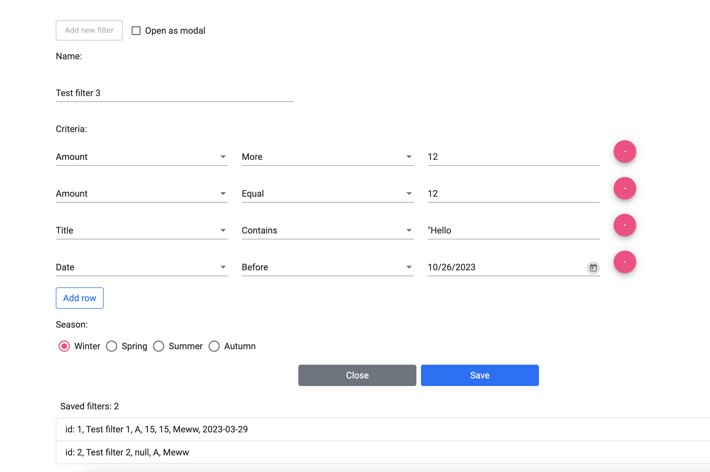

# FiltersApp
A service that allows you to create filters with different criterias. It also provides you with a list of already created filters.

<p align="center">
  
</p>

1. Start backend server:
```shell
cd FiltersApp/filtersapp-backend/
./mvnw spring-boot:run
```
* use  ```mvnw.cmd``` for the Windows environment if you don't have maven installed
* server default port is 8097
* h2 in-memory DB web console url:
```shell
http://localhost:8097/h2-console/
```
* use connection string:
```shell
jdbc:h2:mem:filtersapp
```
* there are 2 filters in the DB created on app startup

2. Start client app:
```shell
npm install
ng serve --open
```
* client opens on port 4400
* it uses Angular material as a basic components library and Bootstrap 5 for layout
